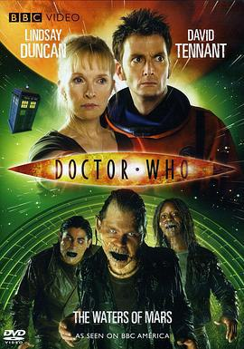

## 1、神秘博士：火星之水
**年代**：2009
**产地**：英国
**语言**：英语
**类别**：科幻
**豆瓣评分**：9.0/10 (5128人评价)
**导演**：格雷姆·哈珀
**主演**：大卫·田纳特/琳赛·邓肯/皮特·奥布莱恩/嘉玛·陈/莎伦·邓肯-布鲁斯特
###### **简介**：《火星鬼水》是《神秘博士》2009特别篇第二弹，于11月15日在BBC1播出。制作人Russell T Davies透露，这集会和接下来的2集关系密切，但并不是三部曲的第一部分。本集献给2009年10月过世的前"神秘博士"编剧兼制作人Barry letts。
--------------------------------------------------------------------------------

## 2、神秘博士：瑞芙·桑恩的丈夫们
**年代**：2015
**产地**：英国
**语言**：英语
**类别**：科幻
**豆瓣评分**：8.3/10 (2973人评价)
**导演**：道格拉斯·麦金农
**主演**：彼得·卡帕尔迪/阿莉克丝·金斯顿/马特·卢卡斯
###### **简介**：圣诞 5343 年，一艘坠毁的飞船发来了一封紧急求救的信息。博士赶到后，发现求救信息来自宋江，她要 Doctor 拯救她的丈夫 —— King Hydroflax 。被卷入这场宇宙阴谋的博士发现宋江竟然不认识他，而他极力避免的那一天终于不可挽回地到来了，宋江与博士会有一个 Happy Ending 吗？
--------------------------------------------------------------------------------

## 3、疯狂的麦克斯4：狂暴之路
**年代**：2015
**产地**：澳大利亚 / 美国
**语言**：英语
**类别**：动作/科幻/冒险
**豆瓣评分**：8.6/10 (302306人评价)
**导演**：乔治·米勒
**主演**：汤姆·哈迪/查理兹·塞隆/尼古拉斯·霍尔特/休·基斯-拜恩/乔什·赫尔曼/内森·琼斯/佐伊·克罗维兹/罗茜·汉丁顿-惠特莉/丽莉·克亚芙/阿比·丽/考特尼·伊顿/安格斯·桑普森/理查德·卡特/梅根·盖尔/肖恩·哈普
###### **简介**：未来世界，水资源短缺引发了连绵的战争。人们相互厮杀，争夺有限的资源，地球变成了血腥十足的杀戮死战场。面容恐怖的不死乔在戈壁山谷建立了难以撼动的强大武装王国，他手下的战郎驾驶装备尖端武器的战车四下抢掠，杀伐无度，甚至将自己的孩子打造成战争机器。在最近一次行动中，不死乔的得力战将弗瑞奥萨（查理兹·塞隆 Charlize Theron 饰）带着生育者们叛逃，这令不死乔恼羞成怒，发誓要追回生育者。经历了激烈的追逐战和摧毁力极强的沙尘暴，弗瑞奥萨和作为血主的麦克斯（汤姆·哈迪 Tom Hardy 饰）被迫上路，而身后不仅有不死乔的追兵，还有汽油镇、子弹农场的重兵追逐。
--------------------------------------------------------------------------------

## 4、黑客帝国
**年代**：1999
**产地**：美国 / 澳大利亚
**语言**：英语
**类别**：动作/科幻
**导演**：莉莉·沃卓斯基/拉娜·沃卓斯基
**主演**：基努·里维斯/劳伦斯·菲什伯恩/凯瑞-安·莫斯/雨果·维文/格洛丽亚·福斯特/乔·潘托里亚诺/马库斯·钟/朱利安·阿拉汗加/马特·多兰/贝琳达·麦克洛里/安东尼雷派克/罗伯特·泰勒/阿达·尼科德莫/罗温·维特/比尔·扬/纳许·埃哲顿
###### **简介**：不久的将来，网络黑客尼奥（基奴李维斯 饰）对这个看似正常的现实世界产生了怀疑。他结识了黑客崔妮蒂（凯莉·安·摩丝 饰），并见到了黑客组织的首领墨菲斯（劳伦斯·菲什伯恩 饰）。墨菲斯告诉他，现实世界其实是由一个名叫“母体”的计算机人工智能系统控制，人们就像他们饲养的动物，没有自由和思想，而尼奥就是能够拯救人类的救世主。
--------------------------------------------------------------------------------

## 5、假面骑士W Returns：假面骑士Accel
**年代**：2011
**产地**：日本
**语言**：日语
**类别**：科幻
**豆瓣评分**：8.3/10 (386人评价)
**导演**：坂本浩一
**主演**：木ノ本嶺浩/山本ひかる/滝裕可里/田中実/俊藤光利/中川真吾/長澤奈央/山野史人/山本康平/なだぎ武/桐山漣/菅田将暉
###### **简介**：日本特摄剧《假面骑士W》中登场的第二位假面骑士。但依故事进度计算，为作中第三名假面骑士。原型为摩托车，通常形态下主色为红色。
--------------------------------------------------------------------------------

## 6、迪迦&戴拿&盖亚·奥特曼 超时空的大决戦
**年代**：1999
**产地**：日本
**语言**：日语
**类别**：科幻/冒险
**豆瓣评分**：8.5/10 (2014人评价)
**导演**：小中和哉
**主演**：吉冈毅志/滨田岳
###### **简介**：一个崇拜奥特曼的男孩小勉,在一次奇妙的际遇中得到了一个红色的玻璃球,原来那是一个能够实现愿望的神奇球,而它可从不同人许下的愿望中更加彰显出许愿者心灵的善恶.....
--------------------------------------------------------------------------------

## 7、头号玩家
**年代**：2018
**产地**：美国
**语言**：英语 / 日语 / 汉语普通话
**类别**：动作/科幻/冒险
**豆瓣评分**：8.7/10 (841114人评价)
**导演**：史蒂文·斯皮尔伯格
**主演**：泰伊·谢里丹/奥利维亚·库克/本·门德尔森/马克·里朗斯/丽娜·维特/森崎温/赵家正/西蒙·佩吉/T·J·米勒/汉娜·乔恩-卡门/拉尔夫·伊内森/苏珊·林奇/克莱尔·希金斯/劳伦斯·斯佩尔曼/佩蒂塔·维克斯/艾萨克·安德鲁斯
###### **简介**：故事发生在2045年，虚拟现实技术已经渗透到了人类生活的每一个角落。詹姆斯哈利迪（马克·里朗斯 Mark Rylance 饰）一手建造了名为“绿洲”的虚拟现实游戏世界，临终前，他宣布自己在游戏中设置了一个彩蛋，找到这枚彩蛋的人即可成为绿洲的继承人。要找到这枚彩蛋，必须先获得三把钥匙，而寻找钥匙的线索就隐藏在詹姆斯的过往之中。
--------------------------------------------------------------------------------

## 8、博士之日
**年代**：2013
**产地**：英国
**语言**：英语
**类别**：科幻
**豆瓣评分**：8.8/10 (6527人评价)
**导演**：尼克·赫伦
**主演**：大卫·田纳特/珍娜·科尔曼/约翰·赫特/马特·史密斯/比莉·派佩
###### **简介**：被列入世界吉尼斯纪录的最长科幻系列电视剧《神秘博士》将迎来第50周年的播放纪念。为了庆祝这部长寿电视剧的半百生日，英国广播公司BBC电视台制作了《神秘博士》特辑，不仅将在英国电视台和电影院同步播映，还将首次以3D形式与观众见面。
--------------------------------------------------------------------------------

## 9、乐高漫威超级英雄：极限过载
**年代**：2013
**产地**：美国
**语言**：英语
**类别**：科幻
**豆瓣评分**：7.9/10 (431人评价)
**主演**：特罗伊·贝克/德雷克·贝尔/弗雷德·塔特西奥/迪·布拉雷·贝克尔/史蒂夫·布卢姆/亚德里安·帕斯达/格雷格·西佩斯/齐·麦克布赖德/罗宾·阿特金·唐斯/邦坡尔·罗宾逊
###### **简介**：极限过载的乐高蜘蛛侠，最受欢迎的英雄和恶棍，与发行规模的乐高奇迹宇宙中的一个样子。22分钟的特别喜剧冒险动画，淘气的洛基挑战的超级漫画英雄，然而这一次，他用超级恶棍征服了地球的军队。钢铁侠，雷神，铁腕，美国队长，尼克，黑寡妇，猎鹰，金刚狼和更多的英雄们对抗。
--------------------------------------------------------------------------------

## 10、别了武器
**年代**：2013
**产地**：日本
**语言**：日语
**类别**：科幻/战争
**豆瓣评分**：8.8/10 (2769人评价)
**主演**：二又一成/檀臣幸/牛山茂/大塚明夫/置鲇龙太郎/森田修平
###### **简介**：看不到一点绿色的荒漠中央，一辆越野车载着数名全副武装的人类疾驰而过。他们来到了那座早已成为废墟的大都市，寻找各种可以回首的有用材料，同时执行这一项极其危险的秘密任务。他们的举动很快就被对手发现，那是一辆战争时期遗留下来的智能战车，它可准确感知对手的存在，并第一时间发动毁灭性的攻击。战士们按照原定计划展开合围，可是根本抵挡不住机器战车的猛烈炮火。
--------------------------------------------------------------------------------

